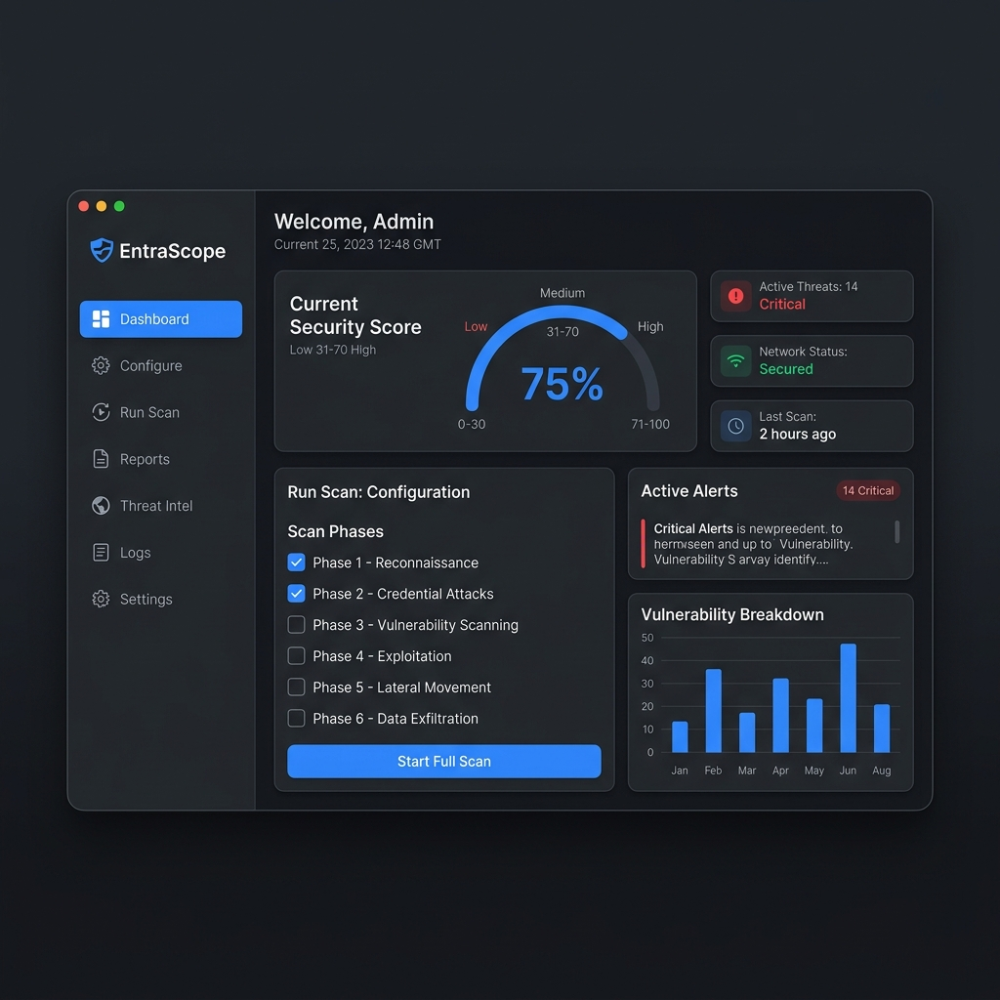
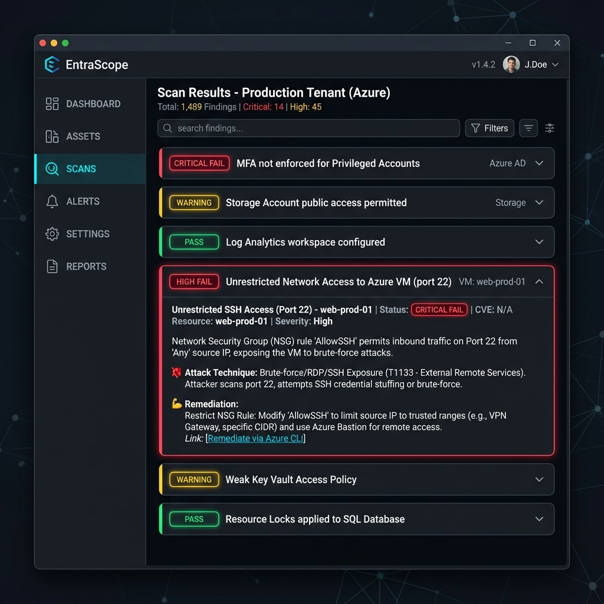

# ⚡ EntraScope

> **Azure & Microsoft 365 Entra External Penetration Testing Toolkit**  
> Test your tenant's defences before attackers do.


---

## ⚠️ Legal Disclaimer

> **This tool is for authorised security testing only.**  
> You must have **explicit written permission** from the tenant owner before running any tests.  
> Using EntraScope against tenants you do not own or have authorisation to test is illegal under the Computer Fraud and Abuse Act (CFAA), the UK Computer Misuse Act, and equivalent legislation worldwide.  
> The authors accept no liability for misuse.

---

## What Is EntraScope?

EntraScope is a **zero-dependency PowerShell toolkit** with a modern GUI that tests your Azure and Microsoft 365 Entra ID tenant against real-world attack techniques. It covers the attack paths documented by Microsoft, CISA, MITRE ATT&CK for Cloud, and known threat actor playbooks.

Unlike compliance audit tools that check policy settings, EntraScope **actively tests** — it attempts the attacks and shows you whether your controls stop them.

### Screenshots

*(Replace these placeholders with your actual screenshots after taking them)*

  



---

## Features

| Phase | What It Tests | Auth Required |
|---|---|---|
| **1 — Recon** | Tenant discovery, federation metadata, user enumeration, dangling DNS, public blob storage, M365 service exposure | ❌ None |
| **2 — Credential Attacks** | Smart Lockout threshold, password spray detection, SMTP/IMAP legacy auth, ROPC flow, MFA push fatigue | 🍯 Honeypot accounts |
| **3 — OAuth / Token Abuse** | Device code flow blocking, user consent controls, token scope escalation, CAE enforcement, workload identity CA | ✅ Graph token |
| **4 — Privilege Escalation** | Self role assignment, SP owner credential abuse, privileged group manipulation, PIM activation requirements, app permission grant abuse | ✅ Graph token |
| **5 — Persistence** | Backdoor app registration detection, stale OAuth grants, break-glass enumeration, guest backdoor invitation | ✅ Graph token |
| **6 — Lateral Movement** | Graph API data pillage, Teams message enumeration, SharePoint access, Key Vault probing, Storage SAS abuse | ✅ Graph token |
| **7 — Azure Resources** | RBAC over-assignment, managed identity abuse, ARM policy gaps, exposed management ports | ✅ ARM token |
| **8 — Detection Gaps** | Sentinel coverage, Defender for Identity deployment, audit log retention, UEBA, risky sign-in alerting | ✅ Graph token |

**37 individual security tests** across 8 attack phases.

### GUI Features
- 🖥 Modern dark-mode WPF + WebView2 interface — no browser required
- ▶️ Live streaming log output during scans
- 📊 Security score gauge with pass/fail/warn breakdown
- 🔎 Filterable results cards — failures auto-expand with attack technique + remediation
- 💾 Auto-saves JSON report on scan completion
- ⚙️ Full configuration UI — no JSON editing required

---

## Requirements

| Requirement | Version |
|---|---|
| Windows | 10 / 11 / Server 2019+ |
| PowerShell | 7.0+ ([download](https://github.com/PowerShell/PowerShell/releases)) |
| Microsoft Edge WebView2 Runtime | Included with Windows 11 / Edge; [download](https://developer.microsoft.com/en-us/microsoft-edge/webview2/) for older systems |
| Internet access | Required for Azure API calls |

**No other dependencies.** No Python, no Node.js, no Azure CLI, no PowerShell modules to install.

---

## Quick Start

### 1. Install Git & Clone

If you don't have Git: [https://git-scm.com/download/win](https://git-scm.com/download/win) — install with default settings.

```powershell
git clone https://github.com/YOUR-USERNAME/EntraScope.git
cd EntraScope
```

### 2. Run the WebView2 Setup (once only)

This downloads the three WebView2 DLLs (~900 KB total) into `gui\wpf\lib\`:

```powershell
pwsh -File gui\wpf\lib\install-dlls.ps1
```

### 3. Launch the GUI

```powershell
pwsh -STA -File gui\wpf\EntraScopeGUI.ps1
```

The window opens. That's it.

---

## Configuration

### Step 1 — Enter Your Tenant

Click **⚙️ Configure** in the sidebar:

- **Tenant Domain**: `yourcompany.onmicrosoft.com`
- Leave Tenant ID blank — EntraScope discovers it automatically

Click **💾 Save**.

### Step 2 - Add Honeypot Accounts (for credential tests)

Honeypot accounts are **dedicated decoy accounts** that credential tests fire bad passwords at. They must exist in your tenant but should never be used by real people.

**Option A: Auto-Provision (Recommended)**
1. Check the `Auto-provision Test Environment` box on the **Run Scan** tab.
2. When you run a scan as a Global Admin, EntraScope will automatically create the honeypot accounts and a test app for you.
3. When the scan finishes, you'll be prompted to automatically remove them.

**Option B: Manual Setup**
See **[docs/ACCOUNT-SETUP.md](docs/ACCOUNT-SETUP.md)** for full manual creation instructions.

Once created manually, add them in **🔧 Configure → Honeypot Accounts**.

> Tests that need honeypot accounts show `SKIPPED` with a clear message if none are configured — nothing will ever fire at real user accounts.

### Step 3 — Run a Scan

Click **▶️ Run Scan**:

1. Choose authentication method:
   - **Interactive** — browser popup (recommended for first run)
   - **Device Code** — enter a code on another device (good for headless)
   - **Service Principal** — Client ID + Secret (good for CI/CD)

2. Select which phases to run (or leave all selected)

3. Tick **☑ Dry Run** to do a no-live-calls smoke test first

4. Click **RUN SCAN** — watch the live log, results appear automatically

---

## Authentication

### What Permissions Does EntraScope Need?

EntraScope is designed to test with **the minimum permissions an attacker would realistically have**. Recommended setup:

| Scenario | What to use | Permissions |
|---|---|---|
| External recon only (Phase 1) | No auth | None |
| Full tenant test | Interactive / Device Code as a **Global Reader** | `Directory.Read.All`, `AuditLog.Read.All`, `Policy.Read.All` |
| Privileged tests (Phase 4–5) | Interactive as **Global Reader** | As above — attempts will fail (PASS) or succeed (FAIL) |
| Azure resource tests (Phase 7) | Interactive with ARM scope | `Reader` on subscriptions |

> [!NOTE]
> EntraScope deliberately uses the same OAuth client IDs that real attackers use (Azure CLI, Microsoft Office) so the tests are realistic. You will see these client IDs in your sign-in logs during a scan.

---

## Account Setup

EntraScope uses two special account types:

### 🍯 Honeypot Accounts
Dedicated decoy accounts that credential attack tests target. Requirements:
- Cloud-only (not synced from AD)
- No licenses assigned
- Enabled in Entra
- Realistic-looking UPN (e.g. `svc-monitor01@yourdomain.com`)

### 🔵 Low-Privilege Test Account
Simulates a compromised standard employee. Requirements:
- No admin roles
- Licensed for Exchange + Teams (for Phase 6 tests)
- MFA registered via Microsoft Authenticator

**Full setup guide with PowerShell scripts**: [docs/ACCOUNT-SETUP.md](docs/ACCOUNT-SETUP.md)

---

## Understanding Results

Each test returns one of:

| Status | Meaning |
|---|---|
| ✅ **PASS** | Control is working — attack was blocked |
| ❌ **FAIL** | Vulnerability confirmed — remediation required |
| ⚠️ **WARNING** | Potential issue — review recommended |
| ⏭ **SKIPPED** | Prerequisite missing (account or token not configured) |
| ℹ️ **INFO** | Informational finding — no action required |

Each FAIL result includes:
- **Attack Technique** — exactly how an attacker would exploit this
- **Result** — what EntraScope found
- **Remediation** — specific steps to fix it with Microsoft docs links

---

## Project Structure

```
EntraScope/
├── EntraScope.ps1              # Command-line runner (no GUI)
├── Setup.ps1                   # First-time setup helper
├── LICENSE
├── README.md
│
├── config/
│   └── scope.json.example      # Copy to scope.json and fill in your details
│
├── docs/
│   └── ACCOUNT-SETUP.md        # Honeypot + test account setup guide
│
├── gui/
│   └── wpf/
│       ├── EntraScopeGUI.ps1   # Main GUI launcher
│       └── lib/
│           └── install-dlls.ps1  # Downloads WebView2 DLLs (run once)
│
├── modules/
│   ├── Phase1-Recon.ps1
│   ├── Phase2-CredAttacks.ps1
│   ├── Phase3-OAuthTokenAbuse.ps1
│   ├── Phase4-PrivEsc.ps1
│   ├── Phase5-Persistence.ps1
│   ├── Phase6-LateralMovement.ps1
│   ├── Phase7-AzureResources.ps1
│   └── Phase8-DetectionGaps.ps1
│
└── reports/                    # Scan output (gitignored)
```

---

## Command-Line Usage (No GUI)

For scripting or headless environments:

```powershell
# Run all phases interactively
pwsh -File EntraScope.ps1 -TenantDomain "contoso.onmicrosoft.com"

# Phase 1 only, dry run
pwsh -File EntraScope.ps1 -TenantDomain "contoso.onmicrosoft.com" -Phases 1 -DryRun

# Service principal auth
pwsh -File EntraScope.ps1 -TenantDomain "contoso.onmicrosoft.com" `
    -AuthMethod ServicePrincipal `
    -ClientId "your-app-id" `
    -ClientSecret "your-secret"
```

---

## Security Notes

- **No secrets stored**: EntraScope never writes credentials, tokens, or passwords to disk
- **Honeypot-only credential tests**: Bad password attempts only ever go to configured honeypot accounts
- **Automatic cleanup**: Phase 5 persistence tests create temporary app registrations and delete them immediately after
- **Rate limiting**: Configurable delay between credential attempts (default 2 seconds) to avoid flooding your logs
- **Audit trail**: All tests are logged with timestamps — review `reports/` after each scan

---

## Contributing

Pull requests welcome. Please:
1. Fork the repo
2. Create a feature branch: `git checkout -b feature/new-test`
3. Follow the existing `New-TestResult` pattern in any new module
4. Include a `DryRun` path and a missing-credential `SKIPPED` path in every test function
5. Open a PR with a description of what attack technique the new test covers

---

## References & Inspiration

- [MITRE ATT&CK for Cloud](https://attack.mitre.org/matrices/enterprise/cloud/)
- [Microsoft Entra security operations guide](https://learn.microsoft.com/en-us/azure/active-directory/fundamentals/security-operations-introduction)
- [AADInternals](https://github.com/Gerenios/AADInternals) — Nestori Syynimaa
- [ROADtools](https://github.com/dirkjanm/ROADtools) — Dirk-jan Mollema
- [CISA SCuBA M365 Secure Configuration Baseline](https://www.cisa.gov/resources-tools/services/secure-cloud-business-applications-scuba-project)
- [PwnLabs / HackTheBox Azure attack paths](https://pwnedlabs.io)

---

## Star History

If EntraScope helped you find vulnerabilities in your tenant, please ⭐ the repo — it helps others find the tool.
